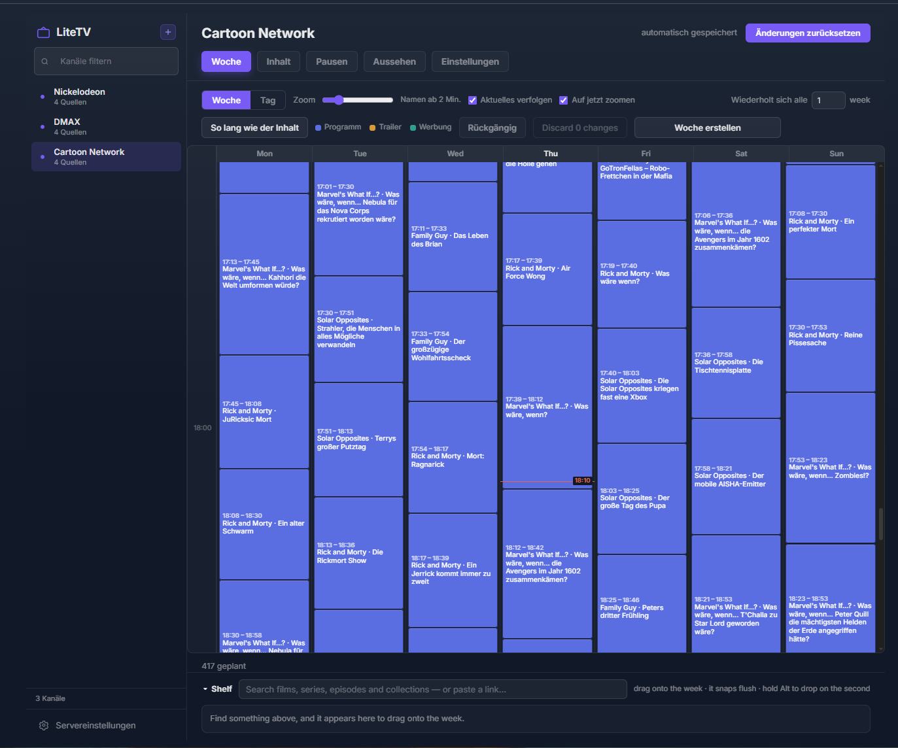
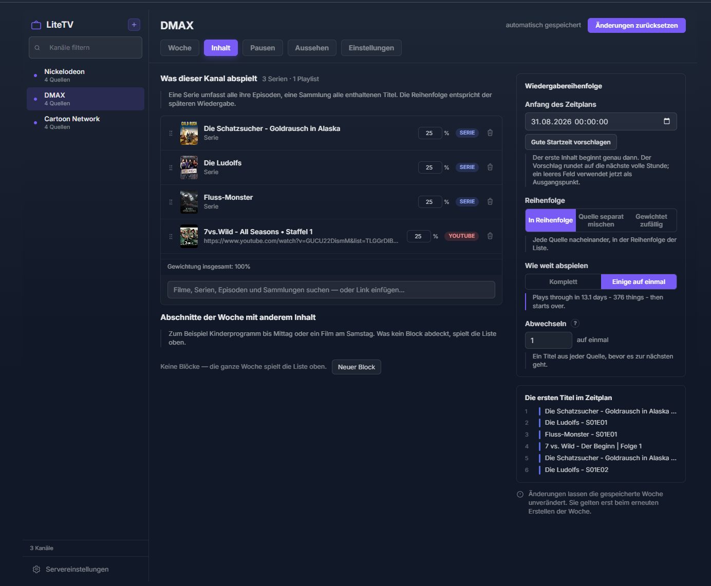
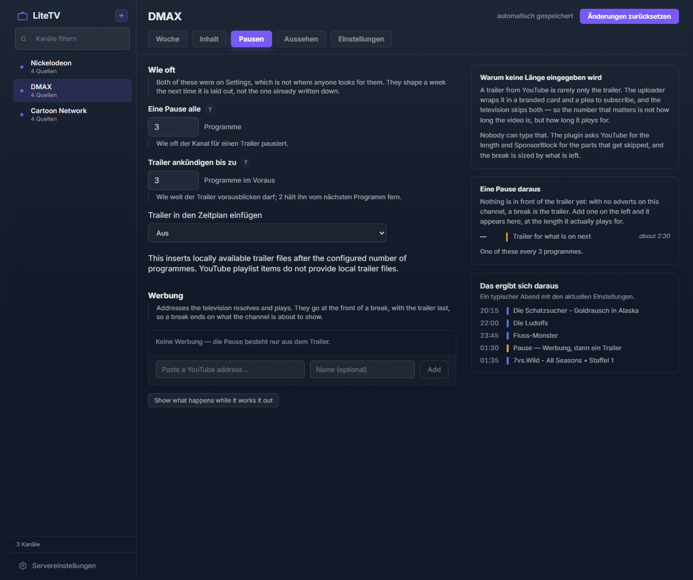
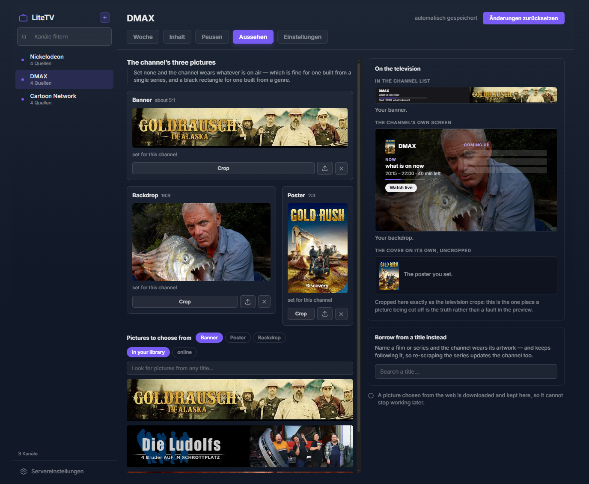

<div align="center">
  
  <h1>LiteTV Channels for Jellyfin</h1>
  <p><strong>Your library, programmed like television.</strong></p>
</div>

LiteTV turns films, series, collections and YouTube playlists from a Jellyfin library into
always-on channels. Every channel has a real schedule: tune in and it starts at the programme
that is on now, at the correct position. No tuner, no background stream and no transcoding layer
are required.

> [!CAUTION]
> **This is a proof of concept, written with AI.** It is purely for testing, and there are
> many items that are known to be incorrect or broken. It is not advisable to use this on a
> non-test server.
>
> For this reason it is offered as is, with **no guarantee of support, bug fixes, or
> troubleshooting**.
>
> **It is NOT recommended to fork or build on top of this plugin!**

## What makes a channel live

LiteTV calculates the schedule from the wall clock, its anchor and playable runtimes. That means
every viewer who tunes in sees the same programme at the same point without a stream running while
nobody watches.

| Build a schedule from | Shape the channel with |
|---|---|
| Films, series, individual episodes and collections | Ordered, source-by-source shuffle, or weighted random playback |
| YouTube playlists alongside library sources | Per-source probabilities that always add up to 100% |
| Ready-made suggestions from the media already available | Episode blocks such as “two at a time”, with optional random episode order |
| A channel's main programme and optional weekly blocks | Film nights, fixed start times, trailers and programme breaks |

Shorter series repeat within a cycle while longer series continue, so a multi-series channel does
not silently lose half of its programmes midway through the week. Film nights use complete
episodes, can move within their configured window to avoid a dead gap, and resume the ordinary
schedule with the next full item afterwards.

## Configure it in Jellyfin

The plugin's own dashboard is where a channel is made, scheduled and styled. It is deliberately
an editor rather than a pile of settings: the weekly plan, its content and how it looks are all
visible in the same place.

<p align="center">
  
  
</p>

- **Week** — view the actual generated schedule, adjust the timeline and create programme blocks.
- **Content** — combine sources, set a real weighted distribution, choose a play order and preview
  the first titles exactly as the scheduler will deal them.
- **Breaks** — add trailers and optional advertising, with breaks sized from the material that
  actually plays rather than a typed guess.
- **Artwork** — give a channel its own banner, backdrop and poster; borrow library art or choose
  and crop a picture for the shape where it will appear.

<p align="center">
  
  
</p>

## Clients and privacy

LiteTV does not publish a conventional Jellyfin library item or Live TV stream. A client that
understands LiteTV asks the plugin for a schedule and builds a normal playback queue at the live
position. This avoids stale entries and lets direct playback remain direct playback.

The supported TV client is the **[Wholphin LiteTV fork](https://github.com/ch-bauer/wholphin-litetv/releases)**
for Android TV. It also supports in-app updates from a LiteTV server update source.

Channel playback uses a dedicated, hidden Jellyfin playback account. Your normal account therefore
does not accumulate Continue Watching entries, resume points, watched flags or Next Up progression
from channel viewing.

## Installation

1. In Jellyfin, open **Dashboard → Plugins → Repositories**.
2. Add this repository URL:

   ```text
   https://raw.githubusercontent.com/ch-bauer/litetv-channels/main/manifest.json
   ```

3. Install **LiteTV Channels** from the catalog and restart Jellyfin.
4. Open **Dashboard → Plugins → LiteTV Channels** to build a channel.
5. On Android TV, install the Wholphin LiteTV fork and connect it to the same Jellyfin server.

## Building from source

```sh
dotnet test tests/Jellyfin.Plugin.LiteTv.Tests
cd web && npm ci && npm run build
dotnet publish src/Jellyfin.Plugin.LiteTv -c Release
```

## License

MIT — see [LICENSE](LICENSE).
